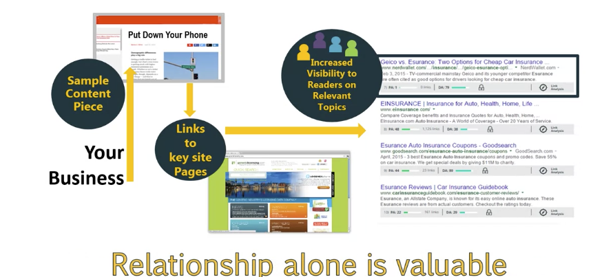

# Advanced Content and Social Tactics to Optimize SEO

Class: SEO
Created: Jun 28, 2020 11:26 AM
Type: Coursera

# Introduction

- Discuss how links are valued
- Discover the types of links that search engines don't like
- Examine how content marketing campaigns are structured
- Use content marketing campaigns to drive higher SEO rankings

## Content Marketing Ecosystem

Value Links

1 PageRank 7 link > 10000 PR2 links

1 level up, 10 times More valuable

1. Infographics : accurate, relevant, high quality
2. Widgets
3. Syndication: duplicate content, do it right, it’s ok. Don’t do on a large scale
4. Article Directories: must be high quality
5. Don’t exchange links

## Guest Posting

Create high-value content, put on someone else’s site

Consider relevances

Avoid guest posting spam, unrelated post

Deliberately created example, fictitious site

## Basic Concepts of Content Marketing

Publish high quality articles on your site

Publish on third party sites and link back to your site

Bank shots: value rebounds from content page to money page

Off site opportunities: guest post

## Content marketing and SEO

Publish on other website: don’t publish where your audience isn’t present

Think about your Content Marketing Ecosystem as a community. Your overall aim should be “all about building relationships” with media, bloggers, influencers and your target audience.

Community: people who care your content

POEM: various kinds of channels you can use to distribute content: Paid, Owned, Earned, and Media

# Social Media

- Describe the supporting role social media marketing plays
- Build relationships with influencers
- Discuss social skills and courtesy
- Build your audience
- Discuss role of links and social media posts
- Use case studies to drive reputation and visibility

Twitter/ Facebook marks links as ‘nofollow’

Search engine will not weight high on signal that may disappear

Algorithm can’t depend on 3rd party

Demographic of different social platforms:

[Social media demographics to inform your brand's strategy in 2020](https://sproutsocial.com/insights/new-social-media-demographics/)

Consider new channel

## Principal of building audiences

1. Be a member of the community
2. Know your audience
3. Give before you ask
4. Share great content: 80% of others, 20% of self
5. Always in public views
6. Be an expert, add value
7. Create content worth sharing

*All* of these things are possible objectives you can consider while developing your strategy to build an audience on social-media and carry out your content marketing campaign:

- Mentions
- Impressions
- Views
- Reach
- Drive major media links and brand mentions
- Drive other links and brand mentions, even when not from major media
- Grow your audience
- Links
- Cultivate influencer relationship
- Online sentiment

## Influence marketing

- Discuss role influencers play
- Analyze the impact of influencers
- Create influencer relationships and collaborations
- Use Facebook advertising to accelerate your visibility

Give reason to influencers

1. Relevant
2. High quality
3. Content is unique and distinct

Many steps to relationships

1. Learn about them
2. Find a way to add value
3. Create trust
4. Relation ship building
5. Connect at conference

# Creating world class content

- Assess the next level of content marketing
- Analyze data to see which content gets the most shares
- Examine successful content examples
- Create successful partnerships
- Examine and explore case studies

Correlation between links and share

Opinion Journalism: people care your opion

Data driven studies work, you must be credible data source

Longer-form content seems to do better in terms of having a correlation between shares and links than shorter-form content. This seems to be because longer-form content tends to have value and depth. So, having in-depth content produces a better chance of getting both shares and links.

People share things cause emotional reaction, which is not authoritatice

[Content, Shares, and Links: Insights from Analyzing 1 Million Articles](https://moz.com/blog/content-shares-and-links-insights-from-analyzing-1-million-articles)

## Anchor content

- Content where – in a single piece – you can drive significant changes in reputation and visibility.
- It’s more about authority than emotion because that's what is most likely to get you both shares and links.
- It's often comprehensive on a topic.
- It has to be materially better than preexisting resources other people have published on the same topic on the web.
- It's dependent on the credibility of the author and the publisher.

## Enhanced content

Vedio

Infographics

Instructionals

Data-driven research studies

Interactives

The data or content must have value.

People must care about the answer it gives you at the end of the interaction.

[A Clear Path for Marketers to Surviving Content Shock](https://moz.com/blog/how-to-thrive-during-content-shock)
