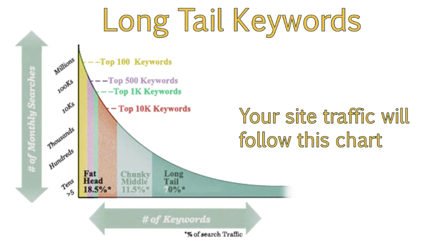

# SEO Fundmentals

Class: SEO
Created: Jun 17, 2020 8:13 PM
Type: Coursera

Key Areas: On-page Optimization, Technical optimization, Off-site Optimization

# On-Page SEO

- Recognize the differences amongst strategies in key areas of SEO
- Use On-page SEO techniques to optimize keywords in meta data
- Complete a competitive analysis on a web page
- Identify meta-tags and use these to make recommendations for On-page SEO

Content, keyword choice, meta data

[On-Page SEO: The Definitive Guide (2020)](https://backlinko.com/on-page-seo)

## Meta data and Meta tag

Meta data: data describes other data (in source code, Inside Head element)

## Title tags

Place keywords at the front of title tag, place brand last using pipe symbol |

Keep 55-60 characters

Separate keywords by hyphens -

Don’t use special characters

## Meta Description

Keyword in meta description do not help a site rank

Increase CTR by providing info to user

Under 160 characters

Too long: google may not use, but use content

Too short: decrease CTR

Sometime let Google choose

Call to action: increase CTR —> ask users to perform an action

Optimize:

1. 150-160 characters
2. Include keywords
3. Include a call to action

## Meta Keyword

Only use in some situation, no longer focus on by seo

Baidu still use it

[Blame The Meta Keyword Tag](https://blogs.bing.com/webmaster/2014/10/03/blame-the-meta-keyword-tag/)

## URL Optimization

Kw in url is still useful but not so important as before

Avoid parameters in URL

History is built under URL, if change URL, use 301 redirect

Not good to seo for URL

### Best practice

1. Don’t change URLs light ly
2. Use 301 redirects
3. Optimize URL from the start
4. Use keywords in URL
5. Use kw in subdirectories
6. Keep URLs short

## Heading Tag

H1,H2,H3...

H1 is most important, H2 is important, not for H3,H4

Multiple headings will be spammy

Make Kw in heading tags

## Unique Content

Content is King

Quality content, related keywords

Match content to topics, organize within subdirectories

Make unique content, quote is fine but better to link back to source

Add values: images, videos

Keyword use: break up keyword usage, don’t use too many instances of a kw

internal link, use anchor text to link out

### Best practice

1. Relevant, well-organized, and unique
2. Don’t over optimize
3. Use synonyms as well as kws
4. User-friendly
5. Add other resources, link, image, video

## Using web crawler to analyze a website

Screaming frog (500 free)

Download the CSV to filter data

[On-Page SEO | The Beginner's Guide to SEO](https://moz.com/beginners-guide-to-seo/basics-of-search-engine-friendly-design-and-development)

# Off-page SEO

- Define Off-page SEO and understand building links to your site
- Interpret brand recognition through social media
- Review link analysis and how social media can help improve your page authority

## Elements

1. Building link to your site
2. Increase brand awareness on social media

PageRank algorithm

Analyze web links to determine the relative importance of website

When link to other site, like a vote

Now, high quality links are more important

## Earning Natural Links

Links should be earned naturally

Provide great content and outreach is still important

### Main link judging factors

1. Quantity of links
2. Quality of the links
3. Relevance of the links
4. Placement of the link ( footer, sidebar links are less value able)

Best type : link surround with content, anchor text

Link disavow tool : in GSC

[Link Building | The Beginner's Guide to SEO](https://moz.com/beginners-guide-to-seo/growing-popularity-and-links)

## Social Media

Correlation with page authority and social media

Indirect influence

Improve reputation

Google will not take account Of social media factors

Social media links are all no follow, but will increase visibility of your brand

[How Social Media Helps SEO [Final Answer]](https://www.searchenginejournal.com/social-media-seo/196185/)

# Technical SEO

- Define Technical SEO and explain some of the basic aspects of this strategy
- Create sitemaps and robot.txt files, plan redirects, and manage site errors
- Identify how to employ best practices in your Technical SEO strategy

Concerns: sitemap, robots.txt, 404 page, redirect

## Sitemap: xml, html

XML: allow search engines to discover links logically

HTML: a page shows links to your website contents

## Robots.txt

## HTTP Response Status Codes

4xx, 5xx

200: OK, success

404: Not found, soft 404

500: server error, can’t return page but sever can’t sepecify

503: server is unavailable

## Redirects

A type of status code

301: permanent redirect, will transfer history/ PA (link juice) to new page

302: temporary redirect

Chain redirect should be avoided, will lose more authority

Don’t redirect to home page, but a new page or category page

## 404 pages best practices

Most common error pages

404s are not all bad

Few 404 should be fine, but lots of 404 will be a problem

Should redirect 404 to appropriate page

Make 404 page has link to your other content

Helpful content: call to action, home page link, search box

[8 Technical SEO Tools You Should Be Using Today](http://blog.hubspot.com/marketing/the-beginners-guide-to-technical-seo-7-resources-you-should-use)

# Keyword Theory & Research

- Discover a variety of strategies for developing keywords for your site
- Examine keyword theory and understand the common behaviors of web searchers
- Use a variety of SEO tools to conduct an audience and learn how to use this data to develop personas of your ideal buyer
- Develop a list of optimal keywords that will help get your site recognized

## Choose right keyword

Understand how people search and why they choose

Keep searcher intent in mind

People use manny different types of quries

More specificity less competition

## Stages of Search

Begin with a broad search topic and then specifically refine

1. Awareness of your brand
2. Evaluate and Refine preferences
3. Make decision

Querries:

1. Navigational query: Brand
2. Informational query: gain more information
3. Transactional: already know what to buy, specific

## Heads, Tails. And Long Tail Keywords

Long tail: higher conversion, less competitive

Head terms: high competitive., high volume

Mid tail: more specific

Long tail: very low volume but should look into

### Question format:

What, Which, Where, Why, How

### Seasonality Trends:

Keyword has seasonality, help decide the publish date

Google trends

### Getting to know your audience

Google trends/ Alexa/ SimilarWeb/ Follwerwonk

Demographic data help optimize the website

Not 100% correct

### Create user persona

Age: will affect the keyword

Location: regional vocabulary, British & American

Gender:
