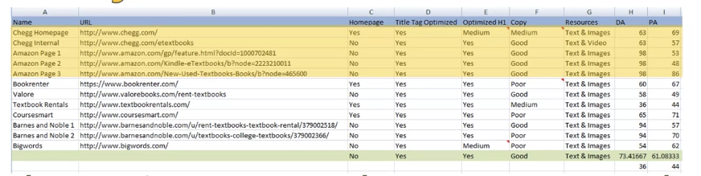

# Optimizing a website for search

Class: SEO
Created: Jun 23, 2020 7:42 PM
Type: Coursera

# Applying keyword research

- Use keyword research to select best keywords to optimize your website in search results
- Review concepts like relevancy to the site, keyword intent, and organic search
- Discuss how to identify and evaluate competitors
- Discuss how to map keywords to pages and how to create a keyword map for your clients and for your own site

Some industries have non competitive keywords

1. Select potential keywords
2. Identify competitiion
3. Evaluate competition
4. Analyze own site

## Perform analysis

Spreadsheet of keywords

Kws with decent value

Highlight keywords in spreadsheet

Related , plural form

Kws response

## Analysis competition

Mom keyword difficulty tool

Keyword list —> theme

For a kw, find top 5-10 competitors

Page name, URL, Page authority

## Develop a plan

Find a list of kw and determine who are main competitors

## Competing with page level

Title tag, H1, content quality, site authority

## Keyword map

1. Make sure we are creating focused pages around keywords
2. Not inadvertently cannibalizing
3. Document onto reference

# Advanced On-Page SEO

- Examine how to analyze, organize, create, and build content utilizing various strategies
- Review how to conduct effective competitive content analysis and internal content audits
- Identify how to create a site-wide content strategy building on the data we uncover in our study and analysis of content

## Competitive content analysis

1. Determine competitor
2. Create tabs for competitor, create column for analysis
3. URL, content, content types, notes, links, twitter, FB shares FB likes, comment, linkedin, pinterest

Social media data : share metrics

Areas to analysis:

- Note the page that is ranking
- Look at the title tag and whether it is optimized, or if there is room for improvement.
- Look at the H1 tag and note whether it is optimized or if there is room for improvement.
- Rate the quality of content on the site.
- Are there any useful resources on this page? If not, can you think of any resources your site might be able to incorporate?
- Note the authority of the page and domain
- Use the information you gathered to analyze how your competition is performing and note down areas of weakness and areas of opportunity for your site.

## Internal audit

1. Seasonality
2. Add more image
3. External / internal links
4. Update/ remove/ combine old content/ low performance content

## Content strategy

1. Content quality —> engagement
2. Shareable

### Domain level content strategy

1. Content related to theme, google will look at whole site
2. Link contents together
3. FAQ—> easy answer and link to deep answer
4. Strong brand

### What’s great content

1. Discoverable ( strong keyword)
2. Connect user to site by CTA
3. Shareable , lead more traffic and explosure

Consider your audience

1. Senior: desktop, vIdeo images
2. Teens: title to grab attention, mobile

Call to action: share the content

Site focus & branding goals

## Types of content

1. Life time value of content:
    1. Evergreen : builds up links and authority
        1. avoid date
        2. Current item
        3. Avoid technology
    2. Trending: not long lasting but shareable
    3. Seasonal: publish few weeks earlier
    4. General - less than evergreen
2. Article types:
    1. List posts
    2. How to posts
    3. Interviews
    4. Check list
    5. Case study/ whitepaper

    Use QA website for brainstorming topic

    Quara

    Buzzsumo

    Yahoo

    Twitter

    Facebook

    Pinterest

    # Local SEO

    - Review how to optimize your Google business pages, on-site content, and external references
    - Describe the history of how Google displays local searches and utilize best practices to develop a high quality local SEO approach

    ## Google my business

    # Creating an SEO Campaign

    - Identify how to manage your relationships with clients
    - Discuss critical first meetings, managing your client’s expectations, and how to track and report on progress toward client goals
    - Develop a solid approach for achieving a productive and successful relationship with your client
